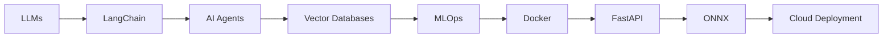

<div align="center">


<br/>

<a href="https://git.io/typing-svg">
  
</a>

<br/>

<i>Building production-ready AI systems that transform research into real-world solutions.</i>

<br/><br/>

<!-- Contact buttons — update links if your handles change -->
[](https://shayan-portfolio-eight.vercel.app/)
[](https://linkedin.com/in/muhammad-shayan-ahmed-05b847281)
[](https://instagram.com/shayan_isalive)
[](mailto:m.shayan.8401@gmail.com)
[](https://github.com/MuhammadShayan8401/leetcode-solutions)

<br/>

[](https://visitcount.itsvg.in)


</div>

---

## 💫 About Me

```python
class Shayan:
    def __init__(self):
        self.name       = "Muhammad Shayan Ahmed"
        self.role       = "Machine Learning & AI Engineer"
        self.university = "Sir Syed University of Engineering & Technology"
        self.degree     = "B.E. Software Engineering, Class of 2027"
        self.location   = "Karachi, Pakistan"
        self.focus      = ["Machine Learning", "Deep Learning", "Computer Vision", "Generative AI", "Healthcare AI"]
        self.learning   = ["LLMs", "LangChain", "AI Agents", "MLOps", "Cloud Deployment"]

    def philosophy(self):
        return "Turn research concepts into real-world AI with clean, reproducible code."

shayan = Shayan()
```

<table>
<tr>
<td width="50%" valign="top">

**🎓 Currently**
- Software Engineering student at **SSUET**, Karachi (Batch 2023F)
- Deep-diving into **Healthcare AI**, **Computer Vision**, and **Generative AI**
- Working through a final-year focus on applied **Deep Learning**

**🔬 What I Do**
- Design and train **deep learning models** for real diagnostic and creative problems
- Build **end-to-end pipelines** — from data ingestion to deployed product
- Ship **full-stack AI applications** with production-grade UI/UX

</td>
<td width="50%" valign="top">

**🧭 How I Work**
- Research-first mindset, engineering-grade execution
- Strong belief in reproducibility and clean architecture
- Comfortable owning a project from model to dashboard to deployment

**🤝 Let's Connect**
- Always open to collaborating on ML/AI research
- Interested in healthcare analytics and predictive systems
- DMs open for interesting problems

</td>
</tr>
</table>

---

## 🧠 AI Expertise

<table>
<tr>
<td width="50%" valign="top">

**🤖 Machine Learning**
Building and tuning classical ML models — regression, classification, and ensemble methods — for real-world predictive tasks.

**🧬 Deep Learning**
Designing CNNs, transformers, and custom architectures using PyTorch and TensorFlow for vision and structured-data problems.

**👁️ Computer Vision**
Semantic segmentation, depth estimation, and image classification using models like SegFormer, MiDaS, and custom CNNs.

**🎨 Generative AI**
Working with diffusion models (Stable Diffusion) and image-to-image pipelines to generate realistic, controllable outputs.

**📈 Predictive Analytics**
Turning historical data into forecasts and risk scores using regression and tree-based models.

**📊 Data Analytics**
Exploratory analysis, feature engineering, and dashboarding to surface insights that drive decisions.

</td>
<td width="50%" valign="top">

**🏥 Healthcare AI**
Applying deep learning to medical imaging — pneumonia detection, skin cancer classification — with a focus on clinical usability.

**💬 LLMs**
Exploring large language model integration, prompt design, and agentic workflows for applied product features.

**📉 Data Visualization**
Building interactive dashboards with Recharts, Plotly, and Streamlit to make model outputs interpretable.

**🚀 Model Deployment**
Serving models via FastAPI/Flask backends, containerizing with Docker, and shipping to platforms like Vercel and Streamlit Cloud.

**⚙️ MLOps**
Managing training reproducibility, versioning, and evaluation pipelines to keep models production-ready.

**🛠️ Feature Engineering**
Crafting and selecting the right signals from raw data to materially improve model performance.

</td>
</tr>
</table>

---

## 🚀 Featured Projects

<div align="center">

<table>
<tr>
<td width="100%">

<h3 align="center">🏡 Aeterna AI Interior Designer &nbsp;</h3>

<p align="center">


</p>

<p align="center">
An end-to-end generative interior-design platform that transforms a photo of any room into a redesigned space. Combines <b>semantic segmentation</b> (SegFormer), <b>depth estimation</b> (MiDaS), and <b>Stable Diffusion img2img</b> generation behind a full FastAPI backend with JWT auth, MongoDB persistence, and a luxury editorial React UI.
</p>

<p align="center"><b>Highlights:</b> Empty-room generation pipeline &nbsp;•&nbsp; History & revisit system &nbsp;•&nbsp; User/admin dashboards &nbsp;•&nbsp; Async-safe preference ANN with five output heads</p>

<p align="center">
<a href="https://github.com/MuhammadShayan8401/Aeterna-AI-Interior-Designer"></a>
<a href="https://aeterna-ai-interior-designer.vercel.app/"></a>
</p>

</td>
</tr>
</table>

<br/>

<table>
<tr>
<td width="50%" valign="top">

<h3 align="center">🧠 AI Pneumonia Detection</h3>

<p align="center">


</p>

<p align="center">
A convolutional neural network trained on chest X-rays to detect pneumonia, later extended into a unified full-stack medical diagnostics dashboard with a second skin-cancer detection module (HAM10000).
</p>

<p align="center"><b>Highlights:</b> Image preprocessing & augmentation &nbsp;•&nbsp; Confusion matrix visualization &nbsp;•&nbsp; Local inference pipeline &nbsp;•&nbsp; Flask + React diagnostics dashboard</p>

</td>
<td width="50%" valign="top">

<h3 align="center">📊 Interactive Business Dashboard</h3>

<p align="center">


</p>

<p align="center">
A modern BI dashboard delivering real-time insights through dynamic KPI charts and interactive filters — built for fast, exploratory business analysis.
</p>

<p align="center"><b>Highlights:</b> Real-time KPI cards &nbsp;•&nbsp; Interactive chart filters &nbsp;•&nbsp; Clean analytics-first UI</p>

<p align="center">
<a href="https://muhammadshayan8401-interactive-business-dashboard-app-sj2opj.streamlit.app/"></a>
</p>

</td>
</tr>

<tr>
<td width="50%" valign="top">

<h3 align="center">💊 Insurance Claim Prediction</h3>

<p align="center">


</p>

<p align="center">
A predictive ML system estimating medical insurance charges from age, BMI, smoking status, and region, wrapped in an interactive Streamlit dashboard for instant what-if analysis.
</p>

<p align="center"><b>Highlights:</b> Feature engineering on demographic data &nbsp;•&nbsp; Regression model comparison &nbsp;•&nbsp; Interactive prediction UI</p>

<p align="center">
<a href="https://insurance-claim-prediction-hjne3ngt7kim52ym9gxxb4.streamlit.app/"></a>
</p>

</td>
<td width="50%" valign="top">

<h3 align="center">🦠 Disease Outbreak Predictor</h3>

<p align="center">


</p>

<p align="center">
A full-stack analytics application that models and predicts disease outbreak trends, pairing a Flask prediction API with a React analytics dashboard and persistent prediction history.
</p>

<p align="center"><b>Highlights:</b> Outbreak trend modeling &nbsp;•&nbsp; Analytics dashboard &nbsp;•&nbsp; Prediction history tracking with MongoDB</p>

</td>
</tr>
</table>

</div>

---

## 🛠️ Tech Stack

<div align="center">

**Languages**


**AI / Machine Learning**


**Frontend**


**Backend**


**Databases**


**Tools & Platforms**


</div>

---

---

# 📊 GitHub Analytics

<div align="center">


<br/><br/>


<br/><br/>

[](https://github.com/ashutosh00710/github-readme-activity-graph)

<br/><br/>


<br/><br/>

<picture>
  <source media="(prefers-color-scheme: dark)" srcset="https://raw.githubusercontent.com/MuhammadShayan8401/MuhammadShayan8401/output/github-contribution-grid-snake-dark.svg">
  <source media="(prefers-color-scheme: light)" srcset="https://raw.githubusercontent.com/MuhammadShayan8401/MuhammadShayan8401/output/github-contribution-grid-snake.svg">
  
</picture>

</div>

## 🌱 Current Learning Roadmap

<div align="center">



</div>

| Area | Focus |
|---|---|
| 🧩 **LLMs** | Prompt design, context management, and applied use cases |
| 🔗 **LangChain** | Chaining tools and retrieval for agentic workflows |
| 🤖 **AI Agents** | Autonomous task execution and tool-calling patterns |
| 🗂️ **Vector Databases** | Embedding storage and semantic search at scale |
| ⚙️ **MLOps** | Reproducible training, versioning, and monitoring |
| 🐳 **Docker** | Containerizing ML services for consistent deployment |
| ⚡ **FastAPI** | High-performance async APIs for model serving |
| 🔄 **ONNX** | Cross-framework model portability and optimization |
| ☁️ **Cloud Deployment** | Shipping models and apps to production environments |

---

## 🏆 Achievements

<table>
<tr>
<td width="50%" valign="top">

- 🚀 Shipped multiple **deployed AI applications** end-to-end, from model to production UI
- 🏥 Built diagnostic-grade **Healthcare AI** systems (pneumonia + skin cancer detection)
- 🎨 Delivered a full **generative Computer Vision** pipeline (segmentation → depth → diffusion)

</td>
<td width="50%" valign="top">

- 📊 Designed **interactive analytics dashboards** used for real-time decision-making
- 🌐 Maintained an active presence with **open-source** repositories and solutions
- 🔬 Applied **research-grade techniques** (custom ANN heads, LayerNorm tuning) in production code

</td>
</tr>
</table>

---

## 🤝 Open to Collaborate

<div align="center">

I'm actively looking to collaborate on:

**Machine Learning** &nbsp;•&nbsp; **Research** &nbsp;•&nbsp; **Healthcare AI** &nbsp;•&nbsp; **Computer Vision** &nbsp;•&nbsp; **Generative AI** &nbsp;•&nbsp; **Data Analytics**

If you're working on something in these spaces — or just want to talk shop — my inbox is open.

</div>

---

## 📬 Contact

<div align="center">

[](https://shayan-portfolio-eight.vercel.app/)
[](https://linkedin.com/in/muhammad-shayan-ahmed-05b847281)
[](https://github.com/MuhammadShayan8401)
[](mailto:m.shayan.8401@gmail.com)
[](https://github.com/MuhammadShayan8401/leetcode-solutions)

</div>

---

<div align="center">

### Thanks for stopping by! 🙌

If something here caught your eye, a ⭐ on one of the repos above always makes my day.


</div>
